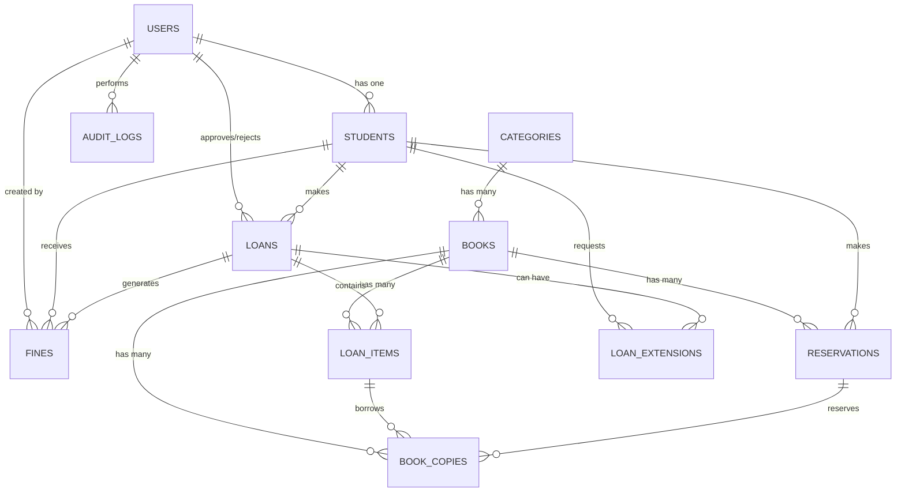

# PHASE 1: ANALYSIS & DATABASE DESIGN
## Sistem Informasi Perpustakaan Sekolah - Skenda

**Status:** ✅ PHASE 1 - COMPLETE
**Tanggal:** 2026-08-30
**Framework:** Laravel 13.17 + Filament 5.0 + PHP 8.3

---

## 1. RINGKASAN KEBUTUHAN

Aplikasi ini adalah sistem manajemen perpustakaan sekolah yang komprehensif untuk operasional sehari-hari. Bukan sekadar CRUD, tetapi sistem yang siap produksi dengan:

- **Data Master:** Buku, Kategori, Siswa, Petugas
- **Transaksi Inti:** Peminjaman, Pengembalian, Reservasi, Perpanjangan
- **Sistem Denda:** Otomatis berdasarkan keterlambatan
- **Notifikasi:** Reminder keterlambatan via sistem notifikasi
- **Laporan:** Komprehensif untuk monitoring perpustakaan
- **Audit Log:** Tracking semua aktivitas penting
- **Authorization:** Role-based dengan granular permissions

---

## 2. ANALISIS ROLE & PERMISSION

### Role: STUDENT (Siswa)
**Akses terbatas pada data diri sendiri**

| Fitur | Izin | Catatan |
|-------|------|---------|
| Katalog Buku | View | Read-only, search & filter |
| Detail Buku | View | Lihat stok & lokasi rak |
| Ajukan Peminjaman | Create | Scan barcode atau manual |
| Riwayat Peminjaman | View Own | Hanya data diri sendiri |
| Buku Sedang Dipinjam | View Own | Dashboard widget |
| Ajukan Perpanjangan | Create Own | Jika memenuhi syarat |
| Ajukan Reservasi | Create Own | Jika stok habis |
| Batalkan Reservasi | Delete Own | Sebelum status AVAILABLE |
| Lihat Notifikasi | View | Reminder keterlambatan |
| Lihat Denda | View Own | Total & riwayat |

**Restriksi:**
- ❌ Tidak boleh ubah stok buku
- ❌ Tidak boleh approve peminjaman
- ❌ Tidak boleh proses pengembalian
- ❌ Tidak boleh akses akun siswa lain
- ❌ Tidak boleh akses laporan administratif
- ❌ Status NONAKTIF/DIBLOKIR = tidak bisa pinjam

---

### Role: STAFF (Petugas)
**Mengelola operasional harian**

| Fitur | Izin | Catatan |
|-------|------|---------|
| Kelola Buku | CRUD | Create/Edit/View/Delete |
| Kelola Kategori | CRUD | Restrict delete jika ada buku |
| Kelola Siswa | CRUD | Semua siswa |
| Kelola Peminjaman | View + Approve | Approve/Reject + Set due_at |
| Tandai Dipinjam | Update | Status → BORROWED |
| Proses Pengembalian | Update | Scan barcode pengembalian |
| Kelola Denda | View + Update | Lihat & update status denda |
| Kelola Reservasi | View + Process | Fulfill + Assign ke siswa |
| Scan Barcode | Create | Tool peminjaman & pengembalian |
| Dashboard Petugas | View | Widget operasional |
| Lihat Laporan | View | Laporan dasar (pinjam, terlambat) |

**Restriksi:**
- ❌ Tidak boleh ubah role pengguna
- ❌ Tidak boleh akses setting sistem kritis
- ❌ Tidak boleh kelola akun Super Admin
- ❌ Tidak boleh view denda siswa individual (kecuali sedang diproses)

---

### Role: SUPER_ADMIN (Admin Sistem)
**Akses penuh ke semua fitur**

| Fitur | Izin | Catatan |
|-------|------|---------|
| Semua Fitur STAFF | ✅ | Full access |
| Kelola Pengguna | CRUD | Semua pengguna |
| Ubah Role | Update | Assign/change role |
| Deaktifkan Akun | Update | Soft disable |
| Kelola Permission | CRUD | Advanced authorization |
| Pengaturan Sistem | CRUD | Durasi, denda, rules |
| Laporan Lanjutan | View | Semua laporan |
| Export Data | Execute | Excel/CSV |
| Audit Log | View | Semua aktivitas |
| Setting Email/Notifikasi | CRUD | Configuration |

---

## 3. BUSINESS RULES UTAMA

### Validasi Peminjaman
1. Siswa harus **aktif** (status = ACTIVE)
2. Siswa **tidak diblokir** (status ≠ BLOCKED)
3. **Stok tersedia > 0**
4. Jumlah pinjaman aktif < limit sistem
5. **Tidak ada pinjaman terlambat** (tanpa extension)
6. Total denda belum dibayar **< batas blokir** (jika ada)

### Limit Peminjaman
- Default: **5 buku/siswa** (configurable)
- Durasi: **7 hari** (configurable)
- Maksimal perpanjangan: **2x** (configurable)
- Grace period keterlambatan: **0 hari** (configurable)
- Denda per hari: **Rp1.000** (configurable)

### Logika Stok
```
Total Stock      = Sum of all book copies
Available Stock  = Total Stock - (copies in status BORROWED + RESERVED)
```

Kalkulasi real-time dari tabel `book_copies` dengan status tracking, bukan stored value (untuk konsistensi).

### Pengembalian Buku
1. Petugas scan barcode buku
2. Sistem cari loan aktif untuk book_copy tersebut
3. Hitung denda jika terlambat
4. Status loan → RETURNED
5. Stok tersedia bertambah
6. Proses reservasi antrean (jika ada)

### Perpanjangan
- Jika buku **tidak ada reservasi antrean** → bisa diperpanjang
- Jika sudah terlambat > grace period → tidak bisa diperpanjang
- Jumlah perpanjangan dibatasi
- Due date baru = old_due_at + loan_duration (bukan sekarang)

### Reservasi & Antrean
1. Siswa buat reservasi (status = WAITING)
2. Buku dikembalikan → sistem cari reservasi tertua
3. Status → AVAILABLE + notifikasi ke siswa
4. Siswa mempunyai waktu tertentu untuk ambil buku
5. Jika tidak ambil hingga `expires_at` → status EXPIRED
6. Sistem tawarkan ke siswa berikutnya

---

## 4. DATABASE DESIGN

### Entity Relationship Diagram (Mermaid)



### Tabel: USERS
```sql
CREATE TABLE users (
    id BIGINT PRIMARY KEY,
    name VARCHAR(255) NOT NULL,
    email VARCHAR(255) UNIQUE NOT NULL,
    username VARCHAR(100) UNIQUE NOT NULL,
    password VARCHAR(255) NOT NULL,
    role ENUM('student', 'staff', 'super_admin') NOT NULL DEFAULT 'student',
    is_active BOOLEAN DEFAULT true,
    last_login_at TIMESTAMP NULL,
    email_verified_at TIMESTAMP NULL,
    remember_token VARCHAR(100) NULL,
    created_at TIMESTAMP,
    updated_at TIMESTAMP,
    
    INDEX(email),
    INDEX(username),
    INDEX(role),
    INDEX(is_active)
)
```

### Tabel: STUDENTS
```sql
CREATE TABLE students (
    id BIGINT PRIMARY KEY,
    user_id BIGINT UNIQUE NOT NULL REFERENCES users(id),
    student_number VARCHAR(50) UNIQUE NOT NULL,
    name VARCHAR(255) NOT NULL,
    class VARCHAR(50),
    major VARCHAR(100) NULL,
    phone VARCHAR(20) NULL,
    email VARCHAR(255) NULL,
    address TEXT NULL,
    status ENUM('active', 'inactive', 'blocked') DEFAULT 'active',
    joined_at DATE,
    created_at TIMESTAMP,
    updated_at TIMESTAMP,
    deleted_at TIMESTAMP NULL, -- Soft delete
    
    FOREIGN KEY(user_id) REFERENCES users(id) ON DELETE CASCADE,
    INDEX(student_number),
    INDEX(status),
    INDEX(class)
)
```

### Tabel: CATEGORIES
```sql
CREATE TABLE categories (
    id BIGINT PRIMARY KEY,
    name VARCHAR(255) NOT NULL,
    slug VARCHAR(255) UNIQUE NOT NULL,
    description TEXT NULL,
    created_at TIMESTAMP,
    updated_at TIMESTAMP,
    deleted_at TIMESTAMP NULL, -- Soft delete
    
    INDEX(name),
    INDEX(slug)
)
```

### Tabel: BOOKS
```sql
CREATE TABLE books (
    id BIGINT PRIMARY KEY,
    isbn VARCHAR(20) UNIQUE NULL, -- Nullable jika tidak ada ISBN
    title VARCHAR(255) NOT NULL,
    author VARCHAR(255) NOT NULL,
    publisher VARCHAR(255) NULL,
    publication_year INT NULL,
    category_id BIGINT NOT NULL REFERENCES categories(id),
    shelf_location VARCHAR(100) NULL,
    description LONGTEXT NULL,
    cover VARCHAR(255) NULL, -- File path
    created_at TIMESTAMP,
    updated_at TIMESTAMP,
    deleted_at TIMESTAMP NULL, -- Soft delete
    
    FOREIGN KEY(category_id) REFERENCES categories(id) ON DELETE RESTRICT,
    INDEX(isbn),
    INDEX(title),
    INDEX(author),
    INDEX(category_id)
)
```

### Tabel: BOOK_COPIES
**Krusial: Setiap copy fisik adalah unit individual dengan barcode sendiri**

```sql
CREATE TABLE book_copies (
    id BIGINT PRIMARY KEY,
    book_id BIGINT NOT NULL REFERENCES books(id),
    barcode VARCHAR(100) UNIQUE NOT NULL,
    inventory_code VARCHAR(100) NULL,
    status ENUM('available', 'borrowed', 'reserved', 'damaged', 'lost', 'maintenance') DEFAULT 'available',
    condition ENUM('good', 'fair', 'poor', 'damaged') DEFAULT 'good',
    shelf_location VARCHAR(100) NULL,
    location_notes TEXT NULL,
    created_at TIMESTAMP,
    updated_at TIMESTAMP,
    deleted_at TIMESTAMP NULL,
    
    FOREIGN KEY(book_id) REFERENCES books(id) ON DELETE CASCADE,
    UNIQUE(barcode),
    INDEX(book_id),
    INDEX(barcode),
    INDEX(status),
    INDEX(shelf_location)
)
```

### Tabel: LOANS
```sql
CREATE TABLE loans (
    id BIGINT PRIMARY KEY,
    loan_number VARCHAR(50) UNIQUE NOT NULL,
    student_id BIGINT NOT NULL REFERENCES students(id),
    status ENUM('pending', 'approved', 'borrowed', 'partially_returned', 'returned', 'rejected', 'overdue', 'cancelled') DEFAULT 'pending',
    
    requested_at TIMESTAMP NOT NULL,
    approved_at TIMESTAMP NULL,
    borrowed_at TIMESTAMP NULL,
    due_at TIMESTAMP NULL,
    returned_at TIMESTAMP NULL,
    
    approved_by BIGINT NULL REFERENCES users(id),
    rejected_by BIGINT NULL REFERENCES users(id),
    rejection_reason TEXT NULL,
    
    notes TEXT NULL,
    created_at TIMESTAMP,
    updated_at TIMESTAMP,
    deleted_at TIMESTAMP NULL,
    
    FOREIGN KEY(student_id) REFERENCES students(id) ON DELETE CASCADE,
    UNIQUE(loan_number),
    INDEX(student_id),
    INDEX(status),
    INDEX(due_at),
    INDEX(loan_number)
)
```

### Tabel: LOAN_ITEMS
**Detail item dalam satu transaksi peminjaman**

```sql
CREATE TABLE loan_items (
    id BIGINT PRIMARY KEY,
    loan_id BIGINT NOT NULL REFERENCES loans(id),
    book_copy_id BIGINT NOT NULL REFERENCES book_copies(id),
    
    due_at TIMESTAMP NOT NULL,
    returned_at TIMESTAMP NULL,
    status ENUM('pending', 'borrowed', 'returned', 'lost') DEFAULT 'pending',
    
    created_at TIMESTAMP,
    updated_at TIMESTAMP,
    
    FOREIGN KEY(loan_id) REFERENCES loans(id) ON DELETE CASCADE,
    FOREIGN KEY(book_copy_id) REFERENCES book_copies(id) ON DELETE RESTRICT,
    INDEX(loan_id),
    INDEX(book_copy_id),
    INDEX(status)
)
```

### Tabel: LOAN_EXTENSIONS
**Riwayat perpanjangan peminjaman**

```sql
CREATE TABLE loan_extensions (
    id BIGINT PRIMARY KEY,
    loan_id BIGINT NOT NULL REFERENCES loans(id),
    
    requested_by BIGINT NOT NULL REFERENCES users(id),
    old_due_at TIMESTAMP NOT NULL,
    new_due_at TIMESTAMP NOT NULL,
    
    status ENUM('pending', 'approved', 'rejected') DEFAULT 'pending',
    approved_by BIGINT NULL REFERENCES users(id),
    
    reason TEXT NULL,
    
    created_at TIMESTAMP,
    updated_at TIMESTAMP,
    
    FOREIGN KEY(loan_id) REFERENCES loans(id) ON DELETE CASCADE,
    INDEX(loan_id),
    INDEX(status)
)
```

### Tabel: RESERVATIONS
**Antrean reservasi buku**

```sql
CREATE TABLE reservations (
    id BIGINT PRIMARY KEY,
    reservation_number VARCHAR(50) UNIQUE NOT NULL,
    student_id BIGINT NOT NULL REFERENCES students(id),
    book_id BIGINT NOT NULL REFERENCES books(id),
    
    status ENUM('waiting', 'available', 'fulfilled', 'expired', 'cancelled') DEFAULT 'waiting',
    queue_position INT NOT NULL, -- Nomor antrian
    
    reserved_at TIMESTAMP NOT NULL,
    available_at TIMESTAMP NULL,
    expires_at TIMESTAMP NULL,
    fulfilled_at TIMESTAMP NULL,
    cancelled_at TIMESTAMP NULL,
    
    created_at TIMESTAMP,
    updated_at TIMESTAMP,
    deleted_at TIMESTAMP NULL,
    
    FOREIGN KEY(student_id) REFERENCES students(id) ON DELETE CASCADE,
    FOREIGN KEY(book_id) REFERENCES books(id) ON DELETE CASCADE,
    UNIQUE(reservation_number),
    UNIQUE KEY unique_active_reservation (student_id, book_id, status) WHERE status IN ('waiting', 'available'),
    INDEX(student_id),
    INDEX(book_id),
    INDEX(status),
    INDEX(queue_position)
)
```

### Tabel: FINES
**Denda keterlambatan**

```sql
CREATE TABLE fines (
    id BIGINT PRIMARY KEY,
    loan_id BIGINT NOT NULL REFERENCES loans(id),
    student_id BIGINT NOT NULL REFERENCES students(id),
    
    amount DECIMAL(10, 2) NOT NULL DEFAULT 0,
    late_days INT NOT NULL DEFAULT 0,
    
    status ENUM('unpaid', 'paid', 'waived') DEFAULT 'unpaid',
    
    paid_at TIMESTAMP NULL,
    paid_by BIGINT NULL REFERENCES users(id),
    
    notes TEXT NULL,
    
    created_at TIMESTAMP,
    updated_at TIMESTAMP,
    
    FOREIGN KEY(loan_id) REFERENCES loans(id) ON DELETE CASCADE,
    FOREIGN KEY(student_id) REFERENCES students(id) ON DELETE CASCADE,
    INDEX(student_id),
    INDEX(status),
    INDEX(loan_id)
)
```

### Tabel: SYSTEM_SETTINGS
**Konfigurasi sistem yang dapat diubah Super Admin**

```sql
CREATE TABLE system_settings (
    id BIGINT PRIMARY KEY,
    key VARCHAR(100) UNIQUE NOT NULL,
    value LONGTEXT,
    data_type ENUM('string', 'integer', 'boolean', 'json') DEFAULT 'string',
    description TEXT NULL,
    created_at TIMESTAMP,
    updated_at TIMESTAMP,
    
    UNIQUE(key),
    INDEX(key)
)
```

**Default Values:**
- `library_name` → Perpustakaan Skenda
- `school_name` → Sekolah Skenda
- `loan_duration_days` → 7
- `max_loans_per_student` → 5
- `max_extensions_per_loan` → 2
- `fine_per_day` → 1000
- `grace_period_days` → 0
- `reservation_hold_days` → 3
- `late_reminder_days` → [3, 1, 0, 1] (H-3, H-1, Tepat jatuh tempo, Hari setelah terlambat)

---

### Tabel: NOTIFICATIONS
**Log notifikasi yang dikirim**

```sql
CREATE TABLE notifications (
    id BIGINT PRIMARY KEY,
    student_id BIGINT NOT NULL REFERENCES students(id),
    type VARCHAR(100) NOT NULL, -- loan_due_reminder, loan_overdue, reservation_available, etc
    title VARCHAR(255) NOT NULL,
    message LONGTEXT,
    
    related_model VARCHAR(100) NULL,
    related_id BIGINT NULL,
    
    is_read BOOLEAN DEFAULT false,
    read_at TIMESTAMP NULL,
    
    sent_at TIMESTAMP NOT NULL,
    
    created_at TIMESTAMP,
    updated_at TIMESTAMP,
    deleted_at TIMESTAMP NULL,
    
    FOREIGN KEY(student_id) REFERENCES students(id) ON DELETE CASCADE,
    INDEX(student_id),
    INDEX(type),
    INDEX(is_read)
)
```

### Tabel: AUDIT_LOGS
**Tracking semua aktivitas penting**

```sql
CREATE TABLE audit_logs (
    id BIGINT PRIMARY KEY,
    user_id BIGINT NULL REFERENCES users(id),
    action VARCHAR(100) NOT NULL, -- create, update, delete, approve, reject, etc
    model_type VARCHAR(100) NOT NULL,
    model_id BIGINT NOT NULL,
    
    old_values JSON NULL,
    new_values JSON NULL,
    
    ip_address VARCHAR(45) NULL,
    user_agent TEXT NULL,
    
    created_at TIMESTAMP,
    updated_at TIMESTAMP,
    
    FOREIGN KEY(user_id) REFERENCES users(id) ON DELETE SET NULL,
    INDEX(user_id),
    INDEX(model_type),
    INDEX(model_id),
    INDEX(action),
    INDEX(created_at)
)
```

---

## 5. ARCHITECTURE LAYERS

### Layer 1: Models (Data Layer)
```
App/Models/
├── User.php
├── Student.php
├── Category.php
├── Book.php
├── BookCopy.php
├── Loan.php
├── LoanItem.php
├── LoanExtension.php
├── Reservation.php
├── Fine.php
├── SystemSetting.php
├── Notification.php
└── AuditLog.php
```

### Layer 2: Enums (Domain Layer)
```
App/Enums/
├── LoanStatus.php
├── StudentStatus.php
├── ReservationStatus.php
├── BookCopyStatus.php
├── FineStatus.php
├── UserRole.php
└── NotificationType.php
```

### Layer 3: Services (Business Logic Layer)
```
App/Services/
├── LoanService.php
├── ReturnService.php
├── FineService.php
├── ReservationService.php
├── BarcodeService.php
├── BookStockService.php
├── NotificationService.php
├── SystemSettingService.php
└── AuditLogService.php
```

### Layer 4: Actions (Task-specific Operations)
```
App/Actions/
├── Loans/
│   ├── CreateLoanAction.php
│   ├── ApproveLoanAction.php
│   ├── RejectLoanAction.php
│   └── CancelLoanAction.php
├── Returns/
│   ├── ProcessReturnAction.php
│   └── CalculateFineAction.php
├── Reservations/
│   ├── CreateReservationAction.php
│   ├── FulfillReservationAction.php
│   └── ExpireReservationAction.php
└── Extensions/
    ├── CreateExtensionRequestAction.php
    └── ApproveExtensionAction.php
```

### Layer 5: Policies (Authorization Layer)
```
App/Policies/
├── BookPolicy.php
├── LoanPolicy.php
├── ReservationPolicy.php
├── StudentPolicy.php
├── UserPolicy.php
└── SystemSettingPolicy.php
```

### Layer 6: Events & Listeners (Event-driven Layer)
```
App/Events/
├── LoanRequested.php
├── LoanApproved.php
├── BookBorrowed.php
├── BookReturned.php
├── LoanOverdue.php
├── ReservationAvailable.php
└── ReservationExpired.php

App/Listeners/
├── SendLoanRejectionNotification.php
├── UpdateBookCopyStatus.php
├── ProcessReservationQueue.php
└── GenerateAuditLog.php
```

### Layer 7: Filament Resources (UI Layer)
```
App/Filament/Resources/
├── Admin/ (Super Admin)
│   ├── BookResource.php
│   ├── CategoryResource.php
│   ├── StudentResource.php
│   ├── UserResource.php
│   ├── LoanResource.php
│   ├── ReservationResource.php
│   ├── FineResource.php
│   ├── SystemSettingResource.php
│   └── AuditLogResource.php
├── Staff/ (Petugas)
│   ├── LoanResource.php
│   ├── ReturnResource.php
│   ├── ReservationResource.php
│   └── StudentResource.php
└── Student/ (Siswa)
    ├── BookCatalogResource.php
    ├── LoanResource.php
    ├── ReservationResource.php
    └── FineResource.php
```

### Layer 8: Pages (Custom UI)
```
App/Filament/Pages/
├── Admin/
│   ├── Dashboard.php
│   ├── LoanApprovalPage.php
│   ├── ReturnProcessPage.php
│   ├── ReportsPage.php
│   └── SystemSettingsPage.php
├── Staff/
│   ├── Dashboard.php
│   ├── QuickReturnPage.php
│   └── BookScannerPage.php
└── Student/
    ├── Dashboard.php
    ├── CatalogPage.php
    └── BorrowPage.php
```

### Layer 9: Widgets (Dashboard Components)
```
App/Filament/Widgets/
├── OverdueLoansWidget.php
├── UpcomingDueWidget.php
├── ActiveReservationsWidget.php
├── BookStatisticsWidget.php
└── TransactionChartWidget.php
```

---

## 6. DESIGN PATTERNS & DECISIONS

### 6.1 Book Model: Copy Pattern
**KEPUTUSAN:** Gunakan `Book + BookCopy` pattern

**Alasan:**
- Setiap copy fisik memiliki identitas sendiri (barcode unik)
- Tracking kondisi per eksemplar (rusak, hilang)
- Audit trail per copy
- Fleksibel untuk perpetuanaan di masa depan
- Mendukung penemuan item fisik yang tepat

**Struktur:**
```
Book (metadata judul)
├── BookCopy #1 (BK-000001) → BORROWED by Student A
├── BookCopy #2 (BK-000002) → AVAILABLE
├── BookCopy #3 (BK-000003) → RESERVED by Student B
└── BookCopy #4 (BK-000004) → DAMAGED
```

---

### 6.2 Stock Calculation: Computed vs Stored
**KEPUTUSAN:** Computed real-time dari `book_copies` status

**Alasan:**
- **Data consistency:** Tidak ada sync issue antara stok dan transaksi
- **Query complexity:** Minimal, karena status tracking jelas
- **Performance:** Agregat query dengan proper indexing cukup cepat
- **Audit trail:** Lebih mudah tracking perubahan stok dari status changes

**Formula:**
```sql
SELECT 
  COUNT(*) as total_stock,
  SUM(CASE WHEN status = 'available' THEN 1 ELSE 0 END) as available_stock,
  SUM(CASE WHEN status = 'borrowed' THEN 1 ELSE 0 END) as borrowed_count,
  SUM(CASE WHEN status = 'reserved' THEN 1 ELSE 0 END) as reserved_count
FROM book_copies
WHERE book_id = ? AND deleted_at IS NULL
```

---

### 6.3 Loan Status: Enum Approach
**KEPUTUSAN:** PHP Enum dengan label Bahasa Indonesia

**Status Flow:**
```
PENDING → APPROVED → BORROWED → RETURNED
                          ↓
                    PARTIALLY_RETURNED
                          ↓
                       RETURNED

PENDING → REJECTED

APPROVED/BORROWED → OVERDUE (via scheduler)
BORROWED → OVERDUE (manual/scheduler)

PENDING/APPROVED → CANCELLED (early cancellation)
```

**Enum Implementation:**
```php
enum LoanStatus: string {
    case PENDING = 'pending';
    case APPROVED = 'approved';
    case BORROWED = 'borrowed';
    case PARTIALLY_RETURNED = 'partially_returned';
    case RETURNED = 'returned';
    case REJECTED = 'rejected';
    case OVERDUE = 'overdue';
    case CANCELLED = 'cancelled';
    
    public function label(): string { ... }
    public function color(): string { ... }
    public function allowedTransitions(): array { ... }
}
```

---

### 6.4 Transaction Safety: Locking Strategy
**KEPUTUSAN:** Database-level row locking untuk operasi kritis

**Kasus Kritis:**
1. Siswa A & B ambil buku terakhir bersamaan
2. Pengembalian double-click
3. Perpanjangan saat sedang di-fulfill dari reservasi

**Implementasi:**
```php
// Dalam transaction
$bookCopy = BookCopy::where('id', $id)
    ->lockForUpdate()
    ->first();
    
// Validasi & update
if ($bookCopy->status === 'available') {
    $bookCopy->update(['status' => 'borrowed']);
}
```

---

### 6.5 Barcode Generation: Safe Sequence
**KEPUTUSAN:** Database sequence + format prefix

**Format:** `BK-XXXXXX` (6 digits padded)

**Process:**
```
1. User create book copy
2. Barcode NULLABLE saat create
3. Background job atau trigger generate barcode otomatis
4. Format: BK-000001, BK-000002, dst
5. Hash/check digit optional untuk production
```

---

### 6.6 Notification System: Multi-channel Ready
**KEPUTUSAN:** Service-based dengan driver pattern

**Driver:**
- Database (langsung ke tabel `notifications`)
- Email (future)
- WhatsApp (future)
- Telegram (future)

**Implementasi:**
```php
NotificationService::send($student, $notification)
  → DatabaseNotificationDriver::send()
  → Saved ke tabel notifications
  
// Future:
NotificationService::send(
    $student, 
    $notification,
    channels: ['database', 'email', 'whatsapp']
)
```

---

### 6.7 Setting Configuration: Cached Approach
**KEPUTUSAN:** Database + Redis cache dengan invalidation

**Pattern:**
```php
// Cache miss → query database
// Cache hit → return cached value
// Setting change → invalidate cache

SystemSetting::get('loan_duration_days')
  → Redis cache hit/miss
  → Return value
```

---

### 6.8 Audit Log: JSON Storage
**KEPUTUSAN:** Simpan old/new values sebagai JSON

**Field:**
- `old_values`: JSON object dari state sebelumnya
- `new_values`: JSON object dari state sesudahnya
- Enables full audit trail & diff comparison

---

## 7. EDGE CASES YANG HARUS DITANGANI

### 7.1 Stok
- [x] Dua siswa ambil stok terakhir bersamaan → Row locking
- [x] Buku dihapus dengan history → Soft delete + foreign key restrict
- [x] Category dihapus dengan buku → Restrict + pesan error
- [x] Pengembalian double-click → Idempotent operation check

### 7.2 Siswa
- [x] Siswa diblokir dengan pinjaman aktif → Status non-active, pinjaman tetap ada
- [x] Siswa dihapus → Soft delete, history tetap ada
- [x] Akun siswa + login user dihapus → Cascade dengan hati-hati

### 7.3 Peminjaman
- [x] Buku sedang dipinjam di-scan lagi → Validasi status existing
- [x] Perpanjangan saat buku di-fulfill dari reservasi → Status check
- [x] Peminjaman rejected tapi buku sudah diambil → Log kejadian
- [x] Setting durasi berubah saat pinjaman aktif → Tidak mengubah pinjaman lama

### 7.4 Pengembalian
- [x] Pengembalian partial (1 dari 3 buku) → PARTIALLY_RETURNED status
- [x] Buku hilang dilaporkan → Status LOST di book_copy
- [x] Double pengembalian → Idempotent check

### 7.5 Denda
- [x] Setting denda berubah saat pinjaman aktif → Simpan nilai aktual
- [x] Denda sudah bayar tapi statusnya UNPAID → Validasi saat query

### 7.6 Reservasi
- [x] Buku dikembalikan → Sistem otomatis fulfill reservation #1
- [x] Siswa pertama tidak ambil buku → Expired, tawarkan ke #2
- [x] Siswa buat reservasi duplikat → Unique constraint + validasi

### 7.7 Notifikasi
- [x] Reminder H-1 dikirim 2x sehari → Idempotent dengan flag `is_sent_today`
- [x] Scheduler crash/restart → Job harus aman jika dijalankan ulang

### 7.8 Concurrency
- [x] Loan creation race condition → Database transaction + row locking
- [x] Reservation queue mismatch → Trigger atau scheduled command

---

## 8. VALIDASI & BUSINESS RULES

### Validasi Buku
- ISBN: maksimal 20 char, nullable
- Barcode: unique, generated if empty
- Title: required
- Stock: integer ≥ 0
- Category: must exist
- Available stock ≤ total stock

### Validasi Siswa
- Student number: unique, required
- Status: active/inactive/blocked
- Email: valid format, unique
- Class: required

### Validasi Peminjaman
- Siswa harus ACTIVE
- Tidak ada pinjaman OVERDUE tanpa extension
- Stok > 0
- Jumlah pinjaman < limit
- Denda < batas blokir (jika ada)

### Validasi Pengembalian
- Loan status = BORROWED atau PARTIALLY_RETURNED
- Book copy bukan status AVAILABLE
- Timestamp pengembalian valid

### Validasi Perpanjangan
- Loan status = BORROWED
- Tidak terlambat > grace period
- Tidak ada reservasi antrean
- Jumlah extension < max

---

## 9. INDEXING STRATEGY

**Frequently Searched:**
- `users.email`, `users.username`
- `students.student_number`, `students.status`
- `books.title`, `books.isbn`, `books.author`
- `book_copies.barcode`, `book_copies.status`
- `loans.loan_number`, `loans.status`, `loans.due_at`
- `reservations.reservation_number`, `reservations.status`

**Frequently Joined:**
- `book_copies.book_id`
- `loans.student_id`
- `loan_items.loan_id`, `loan_items.book_copy_id`
- `reservations.book_id`, `reservations.student_id`

**Frequently Aggregated:**
- `book_copies.status` (untuk count stock)
- `loans.status` (untuk count active)
- `fines.status` (untuk sum unpaid)

---

## 10. PERFORMANCE CONSIDERATIONS

### Query Optimization
- Eager load relationships
- Use select() untuk limit columns
- Aggregate queries untuk count/sum
- Proper indexing pada filter fields

### Caching Strategy
- System settings → Redis cache (invalidate on change)
- Book catalog → Cache invalidate on update
- Student dashboard → Invalidate on new transaction

### Database Transactions
- Loan creation/approval/rejection
- Return processing + fine calculation
- Reservation fulfillment
- All multi-table updates

---

## 11. NEXT STEPS (PHASE 2)

Setelah Phase 1 selesai, lanjut ke:

1. **Phase 2:** Core Models, Enums, Factories
2. **Phase 3:** Authentication & Authorization (Policies, Gates)
3. **Phase 4:** Services & Actions
4. **Phase 5:** Migrations & Seeds
5. **Phase 6:** Filament Resources
6. **Phase 7:** Pages & Widgets
7. **Phase 8:** Events & Listeners
8. **Phase 9:** Scheduled Commands
9. **Phase 10:** Testing & Deployment

---

**Document Status:** ✅ COMPLETE - Ready for Phase 2 Implementation
**Last Updated:** 2026-08-30
